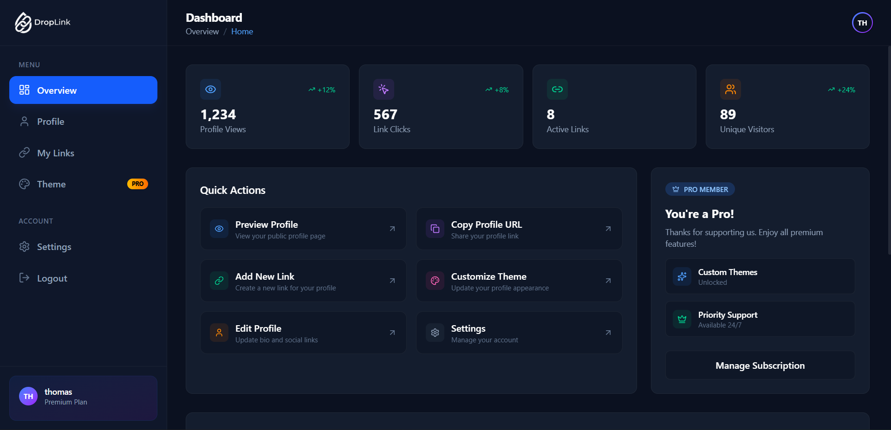

# Droplink


A modern link-in-bio platform that allows users to consolidate multiple links into a single, shareable profile URL. Perfect for marketers, influencers, and content creators who want to showcase their online presence in one place.

## 🚀 Features

- **Customizable Profiles**: Create personalized profiles with bio, avatar, cover image, and theme customization
- **Link Management**: Add, edit, delete, and reorder links with custom titles and icons
- **Analytics Dashboard**: Track profile views, link clicks, and engagement metrics
- **Premium Features**: Advanced themes, analytics, and priority support
- **Responsive Design**: Mobile-first design that works on all devices
- **Secure Authentication**: JWT-based authentication with password hashing
- **Cloud Storage**: Image uploads powered by Cloudinary
- **Real-time Updates**: Instant updates across the platform

## 🛠️ Tech Stack

- **Frontend**: Next.js 16, React 19, TypeScript
- **Styling**: Tailwind CSS
- **State Management**: Zustand
- **Backend**: Next.js API Routes
- **Database**: MongoDB with Mongoose
- **Authentication**: JWT + bcryptjs
- **File Uploads**: Cloudinary
- **HTTP Client**: Axios
- **Icons**: Lucide React

## 📦 Installation

1. **Clone the repository**
   ```bash
   git clone https://github.com/thomas-chacko/Droplink
   cd droplink
   ```

2. **Install dependencies**
   ```bash
   npm install
   ```

3. **Environment Setup**
   Create a `.env.local` file in the root directory with the following variables:
   ```env
   MONGODB_URI=your_mongodb_connection_string
   JWT_SECRET=your_jwt_secret_key
   CLOUDINARY_CLOUD_NAME=your_cloudinary_cloud_name
   CLOUDINARY_API_KEY=your_cloudinary_api_key
   CLOUDINARY_API_SECRET=your_cloudinary_api_secret
   NEXTAUTH_SECRET=your_nextauth_secret
   NEXTAUTH_URL=http://localhost:3333
   ```

4. **Run the development server**
   ```bash
   npm run dev
   ```

   Open [http://localhost:3333](http://localhost:3333) in your browser.

## 🚀 Deployment

The application is configured for deployment on Vercel:

1. **Build the application**
   ```bash
   npm run build
   ```

2. **Start the production server**
   ```bash
   npm start
   ```

## 📁 Project Structure

```
droplink/
├── app/                    # Next.js app directory
│   ├── api/               # API routes
│   ├── dashboard/         # Dashboard pages
│   ├── [username]/        # Public profile pages
│   └── ...
├── components/            # Reusable React components
├── lib/                   # Utility functions and configurations
├── store/                 # Zustand state stores
├── types/                 # TypeScript type definitions
├── constants/             # Application constants
└── public/                # Static assets
```

## 🔧 API Endpoints

### Authentication
- `POST /api/auth/login` - User login
- `POST /api/auth/signup` - User registration

### Links
- `GET /api/links` - Get user's links
- `POST /api/links` - Create new link
- `PUT /api/links/[id]` - Update link
- `DELETE /api/links/[id]` - Delete link

### Users
- `GET /api/user/[username]` - Get public user profile
- `GET /api/users` - Get all users (admin)
- `PUT /api/users/[id]` - Update user

### Upload
- `POST /api/upload` - Upload images to Cloudinary

## 🤝 Contributing

1. Fork the repository
2. Create a feature branch (`git checkout -b feature/amazing-feature`)
3. Commit your changes (`git commit -m 'Add some amazing feature'`)
4. Push to the branch (`git push origin feature/amazing-feature`)
5. Open a Pull Request

## 📞 Contact

For questions or support, please open an issue on GitHub.

---

Built with ❤️ using Next.js and TypeScript